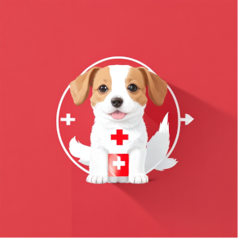

# Pawsitive Health

Are you tired of writing out your pets needs by hand, directly communicating anytime anything changes? Wouldn't it be nice to have a place to share all your pets relevant information with sitters, vets, groomers and more?

Welcome to Pawsitive Health! Your ultimate solution for streamlined pet management.

(Name TDB)

## Table of contents

- [Overview](#overview)
  - [Screenshots](#screenshot)
  - [Links](#links)
- [Features](#features)
- [Running the project](#running-the-project)
- [The Process](#the-process)
  - [Built with](#built-with)
  - [What We learned](#what-we-learned)
  - [Continued development](#continued-development)
  - [Useful resources](#useful-resources)
- [Authors](#authors)
- [Acknowledgments](#acknowledgments)

## Overview

### Screenshots

### Links

## Features

## Running the project

## The Process

- [Chingu Voyage Guide](https://chingucohorts.notion.site/Voyage-Guide-1e528dcbf1d241c9a93b4627f6f1c809)
- [Figma](<https://www.figma.com/file/flYe7l1VL9Nnam5QbccWJo/%F0%9F%93%B2Wireframes-for-mobile-UI-design-(Community)?type=design&node-id=35-0&mode=design&t=tfRV3j8NLcGHZ7l6-0>)
- [Trello](https://trello.com/b/z3mddBWH/voyage-45)
- [Google Docs](https://drive.google.com/drive/folders/1MW9Zsd6Mx8i3dPp7lsDgIWMoIf1qu8Bu?usp=drive_link)
  > Ask for Google permissions if needed

### Built with

### What we Learned

### Continued Development

### Useful Resources

## Authors

- [Alexander Da Costa](https://github.com/BSMuse)
- [Harrison Lynch](https://github.com/LynchHarrison)
- [Kevin Kim](https://github.com/kevykim)
- [Matt Davis](https://github.com/TeddyGavi)

## Acknowledgments

- [Chingu](https://www.chingu.io/)
